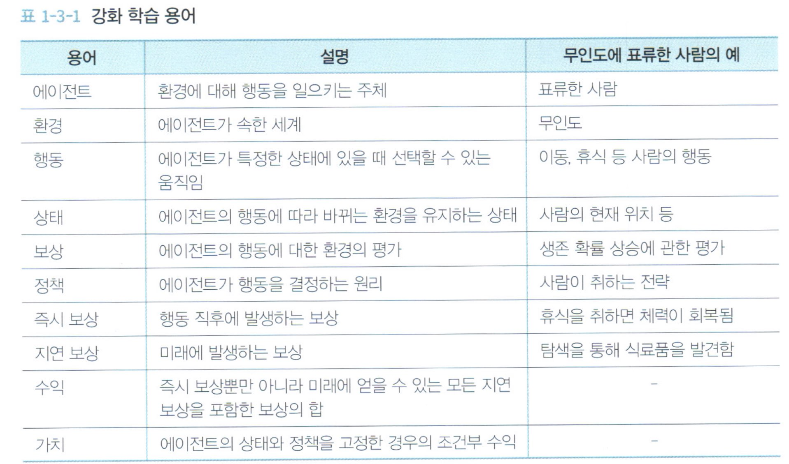
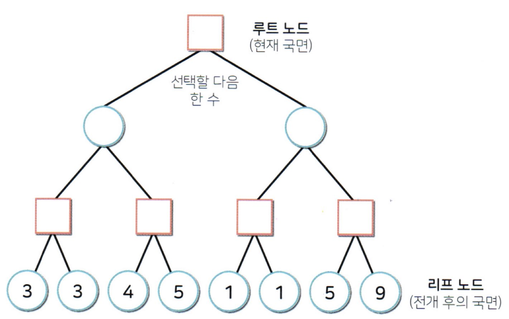

# 정의 
---

- 머신러닝 
    - 강화학습 (Reinforcement_Learning)
    
- Agent(에이전트)가 Environment(환경)의 상태에 맞춰서 어떻게 Action(행동)을 수행해야하는지 혹은 가장 큰 reward(보상)을 받는지 찾아내는 방법이다.
- 학습 데이터가 없다. 
- 시행착오만으로, 경험으로 학습한다. 
    
# case
---

- 설정 

    - A씨는 요트를 타고 무동력 세계일주를 진행하다가 남극 인근에서 난파되어 무인도에 도착하였다. 
    - 생존한다.

- 구성 요소 정의 

    - 에이전트(Agent)    : A씨
    - 환경(Environment)  : 무인도
    - 행동(Action)       : 모든 동적인 행동 
        - 예) 걷는다, 잔다, 밥먹는다, 사냥한다, 요리한다...
    - 보상(Reward)       :  생존에 필요한 도구
        -  예) 물, 동물, 식물(식량획득), 아이템 획득, 체력 획득

# 구성요소
---

## Agent (에이전트)

- 표류한 A씨 

## Action (행동)

- 에이전트가 환경에서 일으키는 움직임을 가지는것

    - 상태(state) 
        -  행동에 따라 변화하는 환경적인 요소 

## Reward (보상)

- 동일한 행동을 취해도 상태에 따라 결과가 달라진다.

- 보상은 생존에 귀결된다. 
    - 좋은 보상 
    - 나쁜 보상 

## Policy (정책)

- 현재의 상태에 따라, 다음행동을 결정하는 기준 
    - 즉, 다음 행동을 결정하기 위한 전략 

## 즉시보상, 자연보상 

- 즉시 보상 

    - 행동직후 즉시 적용되는 (받게되는) 보상
        - 휴식 하면 바로 체력이 채워진다.

- 자연 보상 

    - 미래에 발생되는 보상 
        - 무인도를 10시간 탐사했다. -> 음식을 발견했다.
    - 즉시 보상만 탐하다가, 나중에 발생할 지연 보상이 (더 큰 보상)을 놓칠수 있다. 

## interset (수익)

- 즉시 보상 + 지연보상
    - 강화학습이 목표
- 에이전트의 행동에 따라 결과가 수반된다.
    - 에이전트에게 달렸다. 

## Value (가치)

- 수익이라는 미래의 결론, 에이전의 상태와 정책을 고정하여서, 조건부로 수익을 계산 
- 이런 기준에서 가치를 가장 크게 만들어 낼 수 있는 조건을 찾아낸다.
    - 이것은 곧 학습한것이다.

# 종합

- 가치의 최대화 -> 수익의 최대화 -> 보상을 많이 받는 정책을 강화학습의 목표로 연결

---
</img >
---
</img >
---
</img >
---

# 학습 전략, 사이클
---

- 에이전트는 최초에 어떤행동을 해야할지 판단을 할 수 없다.
    - 선택 가능한 행동에서 랜텀으로 수행 

- 에이전트가 행동의 댓가로 보상을 받으면, 어떤 행동을 했을때, 어떤 보상을 받았는지 기억 -> 경험 
- 경험을 기반으로 정책을 계산 
- 이 과정을 반복하여, 게임 종료시까지 많은 보상을 받을 수 있는 정책을 계산 


## 마르코프 결정 과정 

- 바로 직전에 기술한 내용을 기반으로 한 학습 사이클을 의미 
- MDP (Markov Decision Process)
- 현재 상태에서 선택한 행동에 따라, 다음 상황이 확정되는 시스템 


## 에피소드( Episode)
- 게임 종료시까지 1회의 학습 분량 -> 완료 가능 학습 


## 스텝(Step)
- 1회 행동 분량 -> 원 스텝


# 정책 계산 방법 

## 정책 반복법(Policy Iteration)

- 성공시 선택한 행동이 중요하다.
    - 행동을 많이 수행 이를 통해서 정책을 계산(갱신) 
        - 정책 경사법(알고리즘) 

## 가치 반복법(Value Iteration)

- 다음 상태의 가치와, 현재 상태의 가치의 차이를 계산 
    - 차이만큼 현재 상태의 가치를 늘리는 기법
        - 알고리즘 
            - Sarsa
            - Q Learning
            - DQN

---

# 탐색 

- 턴 게임
    - 바둑, 장기, 체스, 오셀로, 오목등등..
    - 2인 중심 게임 
    - 양측이 교체로 수를 둔다
    - 이런 수를 두면 => 국면이 움직인다. 
        - 최적의 수를 두기 위해서 
            - 국면을 탐색해야한다. 
            - 기초 알고리즘 : 게임트리

- 현재 국면을 기반으로 , 몇 수 앞까지 전개 상황을 미리 검토
    - 이 몇 수 앞까지 진행해보고 그 가치(결과)에 따라 정보를 평가하여, 국면의 상태를 평가한다. 
        - 가장 좋은 다음 한수를 선택

- 게임 트리 
    - 국민의 전개를 표시하는 방법 

```PY
# from IPython.display import Image
# Image( '../data/강화3.jpg', width=400 ) # 루트 노드 
```

- 국면을 노드(사각형(내턴), 원(상대방턴)으로 표시)
- 경우의 수를 아크(노드를 연결하는 선)로 표시한 트리구조 
    - 사각형:자신이 둘 차례의 국면
    - 원형  :상대방이 둘 차례의 국면
    - 최상위 노드:루트 노드, 현재 국면
    - 최하위 노드:리프노드(leaf node), 현재 국면에서 전개가 되고 난 이후 국면
    - 관계   : 위아래(부모,자식), 옆(형제)

- 평가 
    - 현재 국면에서 자신의 국면 상황일때, 우측으로 선택하면 
        - 다음 국면에서 상대방이 오른쪽으로 간다면 9점을 
        - 다음 국면에서 상대방이 왼쪽으로 간다면 1점을 얻게 된다. 

    - 현재 국면에서 자신의 국면 상황일때, 좌측으로 선택을 하면 
        - 최소 3점을 얻게 된다. 


# 완전 게임 트리(Complete Game Tree)

- 게임 시작 

    - 선택할 수 있는 모든 수를 포함 하고 있다. 
    - 절대로 지지 않는 전략을 수립한다. 
    - 실제로 노드가 너무 많다. 
        - 계산이 불가능하다. 

    - case 체스 
        - 임의의 국면에서 가능한 수가 평균 35수 
        - 일반적으로 80수에서 결판 
        - 게임 시작 종료까지 선택가능한 루트의 수 3580 ~ 10120 대략 
        - 한번의 계산도 시간도 많이 걸림 


# 부분 게임 트리(Partial Game Tree)

- 주어진 시간 내에 탐색이 가능한 부분만 포함 
- 그 중에 유용하다고 판단이 되는 노드를 집중해서 더 판다.
- 유용하지 않다면 해당 노드를 종료한다. 

- 이런 처리 기법을 게임 AI의 능력치 판단 
    - 미니 맥스법 
    - 알파 베타법
    - 원시 몬테카를로 탐색
    - 몬테카를로 트리 검색 
    - DQN


