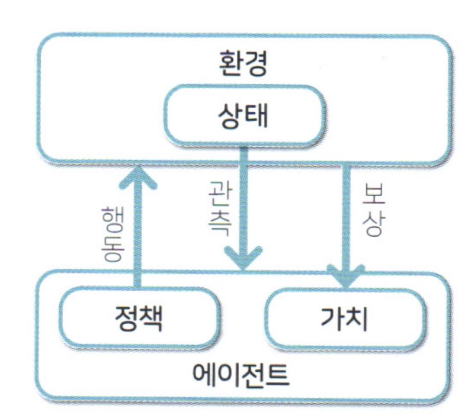

# AI 미래 가치 

- 약 AI (현재~)
  - 하나의 업무만 잘한다.

- 강 AI (2040 도래)
  - 인지능력이 사람에 수준으로 도달하는 AI
  - 여러개를 잘하는 AI

- 초 AI (2060 도래)
  - 인간의 인지 능력을 초월한 수준
  - 인간이 AI를 이해하지 못하는 단계

# 강화학습의 정의 

- 머신러닝 
    - 강화학습(Reinforcement_Learning)
        - Agent(에이전트)가 Environment(환경)의 상태에 맞춰서 어떻게 Action(행동)을 수행해야하는지 혹은 가장 큰 reward(보상)을 받는지 찾아내는 방법이다.
        - 학습 데이터가 없다. 
        - 시행착오만으로, 경험으로 학습한다. 

# 스토리 설정

- 강화학습의 이해를 돕기 위한 스토리  
---    
    A씨는 꿈이있었다. 요트를 타고 무동력 세계일주를 하는것이 그의 꿈이었다. 
    그는 그 꿈을위해 직장을 그만두고 모아둔 돈으로 요트를 구매하고 여행을 할 만만의 준비를 끝냈다. 
    그렇게 그는 요트를 타고 무동력 세계일주를 진행하는데 ...

    남극 인근에 도착했을 무렵 갑작스럽게 요트에 문제가 생겨 ... 어떤섬에 떨어졌는데..
    그 섬은 아무도 살지 않는 무인도였다...  
---

## 상황 

- A씨는 요트를 타고 무동력 세계일주를 진행하다가 남극 인근에서 난파되어 무인도에 도착하였다. 
- 생존한다. 그리고 생존 해야한다 .

---

# 강화학습을 위한 요소 정의

- 에이전트(Agent)    : A씨
- 환경(Environment)  : 무인도
- 행동(Action)       : 모든 동적인 행동 
    - 예) 걷는다, 잔다, 밥먹는다, 사냥한다, 요리한다...
- 보상(Reward)       :  생존에 필요한 도구
    -  예) 물, 동물, 식물(식량획득), 아이템 획득, 체력 획득

## Agent (에이전트)

- 표류한 A씨 

## Action (행동)

- 에이전트가 환경에서 일으키는 움직임을 가지는것

    - 상태(state) 
        -  행동에 따라 변화하는 환경적인 요소 

## Reward (보상)

- 동일한 행동을 취해도 상태에 따라 결과가 달라진다.

- 보상은 생존에 귀결된다. 
    - 좋은 보상 
    - 나쁜 보상 

## Policy (정책)

- 현재의 상태에 따라, 다음 행동을 결정하는 기준 
    - 즉, 다음 행동을 결정하기 위한 전략 

## 즉시보상, 자연보상 

- 즉시 보상 

    - 행동직후 즉시 적용되는 (받게되는) 보상
        - 휴식 하면 바로 체력이 채워진다.

- 자연 보상 

    - 미래에 발생되는 보상 
        - 무인도를 10시간 탐사했다. -> 음식을 발견했다.
    - 즉시 보상만 탐하다가, 나중에 발생할 지연 보상이 (더 큰 보상)을 놓칠 수 있다. 

## interset (수익)

- 즉시 보상 + 지연보상
    - 강화학습이 목표

- 에이전트의 행동에 따라 결과가 수반된다.
    - 에이전트에게 달렸다. 

## Value (가치)

- 수익이라는 미래의 결론, 에이전의 상태와 정책을 고정하여서, 조건부로 수익을 계산 
- 이런 기준에서 가치를 가장 크게 만들어 낼 수 있는 조건을 찾아낸다.
    - 이것은 곧 학습한 것이다.

## 에피소드( Episode )

- 게임 종료시까지 1회의 학습 분량 
    - 완료 가능 학습 

## 스텝(Step)

- 1회 행동 분량 -> 원 스텝

---

# 종합

- 가치의 최대화 -> 수익의 최대화 -> 보상을 많이 받는 정책을 강화학습의 목표로 연결

---
</img >
---
</img >
---
</img >
---
---

# 학습 전략, 사이클

- 에이전트는 최초에 어떤 행동을 해야할지 판단을 할 수 없다.
    - 선택 가능한 행동에서 랜텀으로 수행 

- 에이전트가 행동의 댓가로 보상을 받으면, 어떤 행동을 했을때, 어떤 보상을 받았는지 기억 
    - 경험 
- 경험을 기반으로 정책을 계산 
- 이 과정을 반복하여, 게임 종료시까지 많은 보상을 받을 수 있는 정책을 계산 

## 마르코프 보상 과정 
    - 참고 :<https://untitledtblog.tistory.com/139>

## 마르코프 의사결정 과정 : MDP(Markov Decision Process)

- Markov reward process에 action이라는 요소가 추가된 모델
    - 인지 - sensation
        - 에이젼트는 환경이 어떤 상태인지 인지할 수 있어야 한다. 
    - 행동 - action
        - 에이젼트는 주어진 상태에 따라 행동을 결정한다.
    - 목표 - goal
        - 강화학습의 모든 문제에는 목표가 있어야 한다. 

---

- 불확실한 상황 하에서 의사결정을 하려면 '확률'에 기초하여 분석을 해야한다. 
- 어떤 사건이 발생할 확률 값이 시간에 따라 변화해 가는 과정을 확률적 과정(Stochastic Process)

- 확률적 과정 중에서 한가지 특별한 경우가 마코프 과정(Markov Process)
    - 마코프 과정은 어떤 상태가 일정한 간격으로 변하고, 다음 상태는 현재상태에만 의존하며 확률적으로 변하는 경우의 상태의 변화를 뜻한다. 

    - 즉, 현재 상태에 대해서만 다음 상태가 결정되며, 현재 상태에 이르기까지의 과정은 전혀 고려할 필요가 없다.

- 마코프 과정에서 연속적인 시간 변화를 고려하지 않고, 이산적인 경우만 고려한 경우를 마코프 연쇄(Markov Chain) 

- 바로 직전에 기술한 내용을 기반으로 한 학습 사이클을 의미 
- 현재 상태에서 선택한 행동에 따라, 다음 상황이 확정되는 시스템

**자세한 내용은 별도로**

----

# 전개 방향 

- 개별 알고리즘 -> 탐색 처리 -> 그래픽스 -> 게임AI구현 -> 게임 구현 완료

---

## 정책 계산 방법 

- 최적의 정책 함수(Optimal Policy Function)를 찾는 방법

    - 강화학습을 해결하는 가장 기본적인 방법은 두 가지가 존재 
        - 값을 반복 (Value Iteration)
        - 정책을 반복 (Policy Iteration)

### 정책 반복법(Policy Iteration)

- 성공시 선택한 행동이 중요하다.
    - 행동을 많이 수행 이를 통해서 정책을 계산(갱신) ->  정책 경사법(알고리즘) 
- 정책 반복법은 에피소드 1 단위로 일종의 보상을 갱신함으로써, 보상으로 파라미터를 최적화

### 가치 반복법(Value Iteration)

- 다음 상태의 가치와, 현재 상태의 가치의 차이를 계산 
    - 차이만큼 현재 상태의 가치를 늘리는 기법

- 가치를 중시
    - 가치 반복법은 행동 1회 단위로 파라미터를 갱신함
    - 어떤 행동 선택시, 다음 상태 가치와 현재 

    - 알고리즘 
        - Sarsa(살사)
            - 수렴은 느리지만, 국소적인 해답에 갇히지 않는다.(유연한 답을 가짐)
        - Q Learning
            - 수렴은 빠르다. 국소적인 해답에 갇히기 쉽다. 
        - DQN
---
